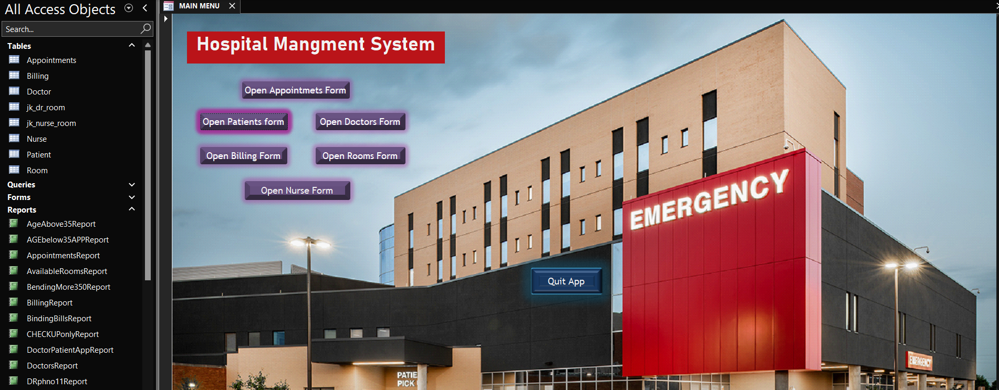

# Hospital Management System

This is a Microsoft Access-based Hospital Management System project developed by *Youssef962*.

The system provides basic functionality for managing hospital operations, including patient records, doctor information, appointments, billing, and reports.

## Features

✅ Patient management  
✅ Doctor management  
✅ Appointments scheduling  
✅ Billing system  
✅ Custom reports  
✅ User authentication (login system)  

## How to Use

1. Download the file: [HospitalManagementSystem.accdb](./HospitalManagementSystem.accdb)
2. Open it using *Microsoft Access* (version 2016 or newer recommended).
3. Enable content/macros if prompted.
4. You will be presented with a *login screen*.

## Login Information

This project is protected with a username and password.

👉 If you would like to request *access credentials to test the system*, please contact me via:

- GitHub Issues
- Email: [youefq8@gmail.com]

This is done to protect the system from unauthorized public access.

## Screenshot

## License

This project is shared for educational and demonstration purposes.  
For any commercial use, please contact the author.

## Author

Youssef962
